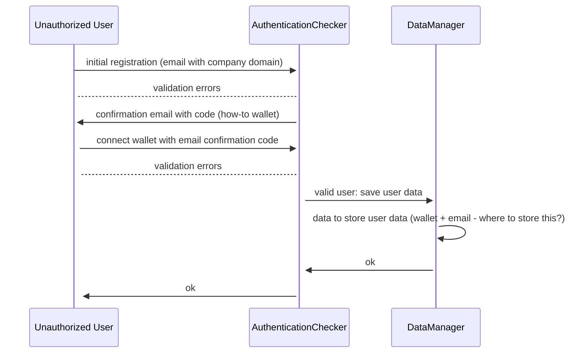
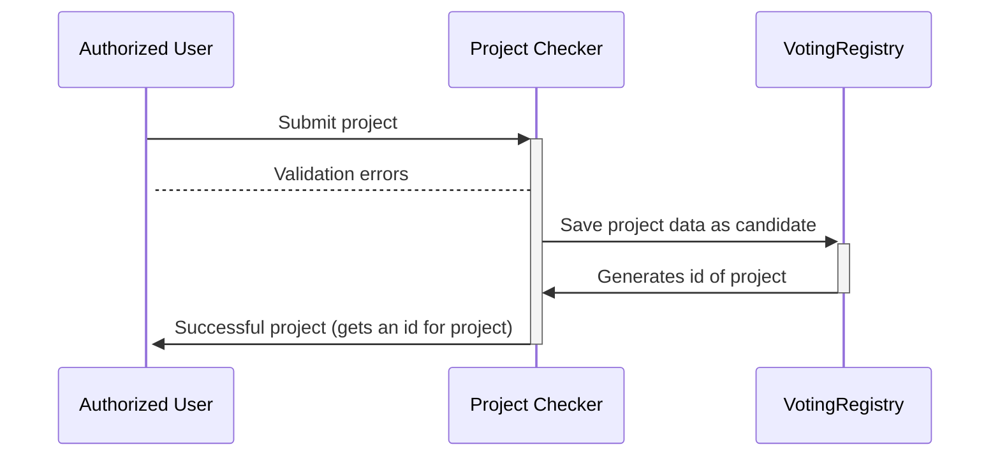

# OpenInnovationDAO [name to be changed]

## To define:

### Auth

- Problem:        How are we making sure only real allowed users can vote and vote only once?
- Possibility 1:  email company address + token generated by the DAO?

### Project submission

