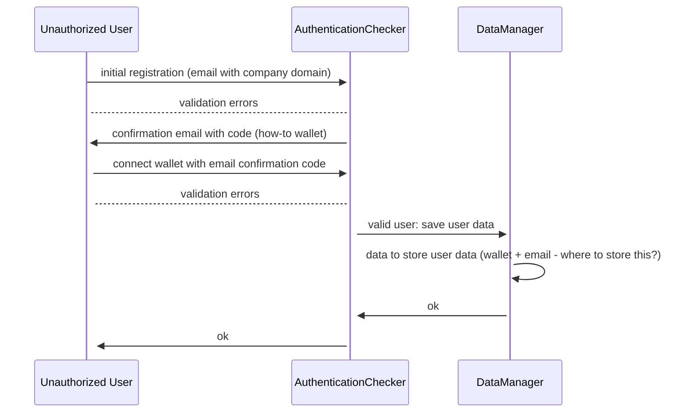
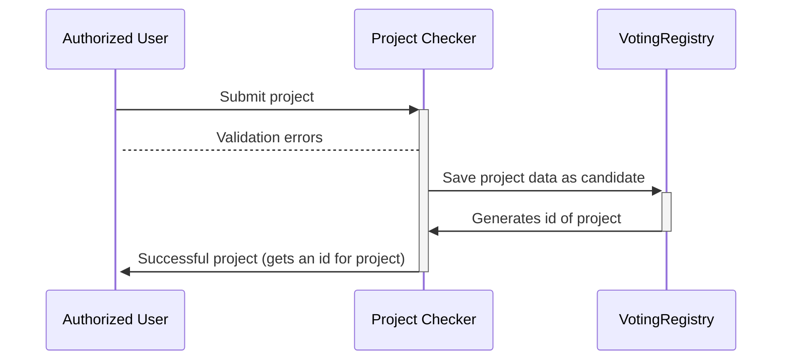
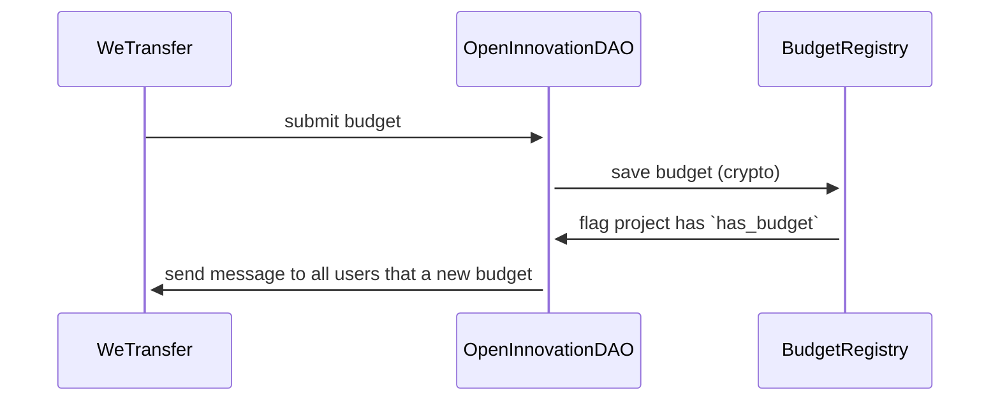
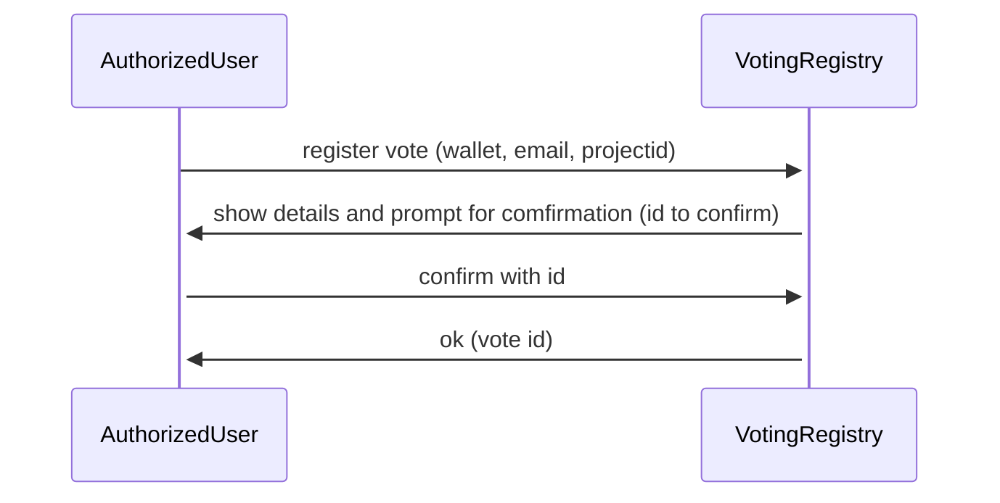

# OpenInnovationDAO [name to be changed]

## To define:

### Auth

- Problem:        How are we making sure only real allowed users can vote and vote only once?
- Possibility 1:  email company address + token generated by the DAO?

### Project submission

### Budget registration

### Project voting

### Project member submission
TODO:
- queue of members for each project
- try to find a very democratic way to select engineers, designers, project managers, business analists and etc.
- voting maybe?

# GENERAL TODO

- finish the flows and graphs
- have a flow for submitting project constraints per each company (voted by the users)
- having a time window to vote and start a project (constraint)
- as authenticated you could volunteer to work on a project
- [] decentralized CV and validator of professional skills
